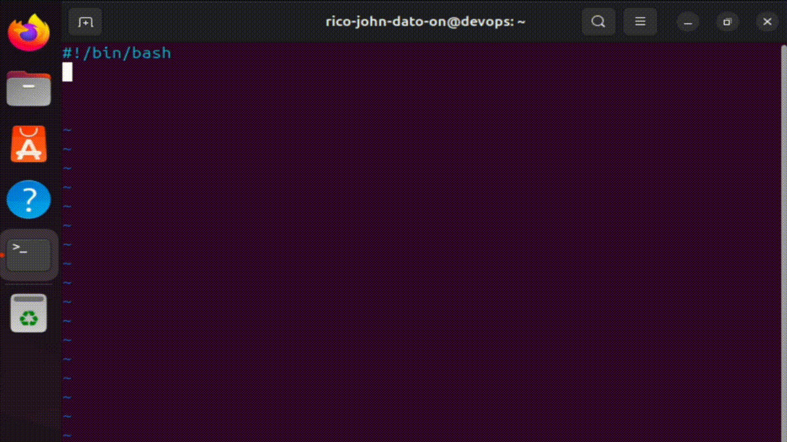

# Bash Scripting (Variables, Conditionals, Parameters, While Loop)

In this README, you will learn about Bash scripting in Linux, including concepts such as variables, conditionals, loops, and more.

## Variables

Variables store data that can be reused. They are declared using:

To reference a variable:

```bash
file_name=config.sh
echo "Using file $file_name to configure..."
```


To store command output:

```bash
config_files=$(cat config)
echo -e "Here is the configuration file:\n$config_files"
```



## Conditionals


Check if a directory exists:

```bash
if [ -d test_dir ]; then
        echo -e "Reading test_dir contents...\n"
        ls test_dir | echo -e "Total files = $(wc -l)\n\nThis are the contents:\n$(ls test_dir)"
else
        echo "test_dir not found. creating one..."
        mkdir test_dir
        touch test_dir/testing_dir test_dir/test_file.txt
fi
```

Check number comparisons:

```bash
file_count=$(ls test_dir | wc -l)

if [ "$file_count" -lt 10 ]; then
        echo -e "\n'test_dir' folder is less than 10 files\n\nTotal files inside the test_dir = $file_count\n"
fi
```

String comparisons:

```bash
user_group=$(groups rico-john-dato-on | grep -o '\bdevops\b')

if [ "$user_group" == "devops" ]; then
        echo -e "\n$(whoami) belongs to $user_group\n"
fi
```

## Parameters


Accept parameters in the script:

```bash
directory=$1
user_group=$2

echo "The directory will be using is: '$directory' and belongs to the group of: '$user_group'"
```

Execute:

```bash
./test1.sh test_dir devops
```

## Loops

### For Loop


```bash
for param in "$@"
do
  echo "Parameter: $param"
done
```

### While Loop


```bash
sum=0
while true
do
    read -p "Enter score (or q to quit): " score
    if [ "$score" = "q" ]; then
        break
    fi
    # Check if the input is a valid number before adding
    if [[ "$score" =~ ^[0-9]+$ ]]; then
        sum=$((sum + score))
        echo "Total: $sum"
    else
        echo "Invalid input. Please enter a number or 'q'."
    fi
done
```

## Summary

This guide has covered key Bash scripting concepts useful in DevOps, including variable handling, input/output, conditionals, loops, and script execution.

🧑‍💻 _Created by Rico John Dato-on_  
🔗 [LinkedIn](https://www.linkedin.com/in/rico-john-dato-on) • [Portfolio](https://ricodatoon.netlify.app)
