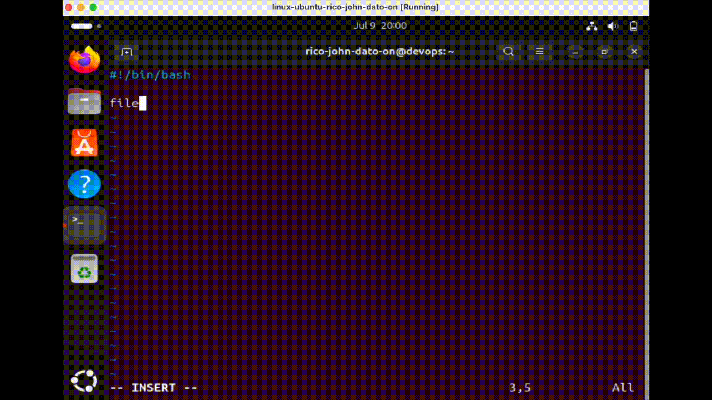

# Bash Scripting (Variables, Conditionals, Parameters, While Loop)

In this README, you will learn about Bash scripting in Linux, including concepts such as variables, conditionals, loops, and more.

## Variables

Variables store data that can be reused. They are declared using:

To reference a variable:

```bash
file_name=config.sh
echo "Using file $file_name to configure..."
```



To store command output:

```bash
config_files=$(ls ./config.sh)
echo "Here are all configuration files:” && $config_files
```

## Conditionals

Check if a directory exists:

```bash
if [ -d "$config_dir" ]; then
  echo "Reading config directory contents"
else
  echo "Config directory not found. Creating one."
  mkdir $config_dir
fi
```

Check number comparisons:

```bash
if [ "$number_of_files" -lt 10 ]; then
  echo "Less than 10 files"
fi
```

String comparisons:

```bash
if [ "$user_group" = "admin" ]; then
  echo "Administering server"
else
  echo "No permission"
fi
```

## Parameters

Accept parameters in the script:

```bash
#!/bin/bash
config_dir=$1
user_group=$2
```

Execute:

```bash
./script.sh config admin
```

## Loops

### For Loop

```bash
for param in "$@"
do
  echo "Parameter: $param"
done
```

### While Loop

```bash
sum=0
while true
do
  read -p "Enter score (or q to quit): " score
  if [ "$score" = "q" ]; then
    break
  fi
  sum=$((sum + score))
  echo "Total: $sum"
done
```

## Summary

This guide has covered key Bash scripting concepts useful in DevOps, including variable handling, input/output, conditionals, loops, and script execution.
